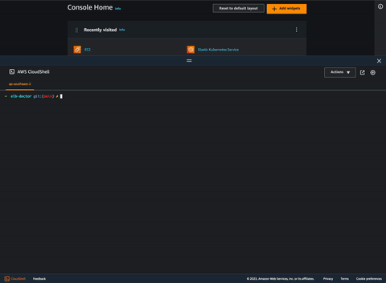

# ELB Doctor

Sometimes troubleshooting AWS ELB can be very difficult and intimidating due to the complexity of the virtual cloud network and the various ELB types/features. Navigating in the multi-layered AWS console to look for clues is not an easy task either and could often be time-consuming. This tool provides a no-brainer CLI wizard to help you check ELB basics, display target group health status, and potentially identify the root cause.

<p align="center"></p>

## Installation
ELB Doctor has not been published to PyPI yet, though we do have a plan in the near future.
We recommend using AWS CloudShell to install and run ELB Doctor, as it automatically configures your credentials for use with AWS services. To use AWS CloudShell, simply open the AWS Management Console, click on the CloudShell icon, and enter the commands below into the CloudShell command line interface.

1. Ensure you can run Python from the command line. You should get some output like Python 3.X.X. 
     ```bash 
     python3 --version
     ```

2. Clone this repository and change to its directory
     ```bash
     git clone https://github.com/aws/elb-doctor
     cd elb-doctor/
     ```
3. Install ELB Doctor locally using `pip`: 
     ```bash
     python3 -m pip install .
     ```

4. Start ELB Doctor using `elbdoc` command: 
     ```bash
     elbdoc
     ? What is the AWS region of your ELB?  (Use arrow keys)
    ❯ us-east-1(N. Virginia)
      us-east-2(Ohio)
      us-west-1(N. California)
      us-west-2(Oregon)
     ```

If you want to use ELB Doctor in your local terminal, see the instructions below:

  * Ensure a valid CLI credential is configured as described [here](https://docs.aws.amazon.com/cli/latest/userguide/getting-started-quickstart.html). See the below IAM Permission section for the required permissions.
  * Create a virtual Python environment with the following commands prior to running `python3 -m pip install .`:
     ```bash
     # Example commands to create a virtual environment 

     $ python3 -m venv env 
     $ source env/bin/activate  # On Windows, use `.\env\Scripts\activate`
     ```


This procedure will help in setting up ELB Doctor for local use while ensuring a separated environment for its dependencies.

## IAM Permission

The least IAM previledge required for using ELB Doctor is listed below. 
The IAM policy that's attached to your IAM role must include at least the following permissions. 
It is recommended to run the tool in [AWS CloudShell](https://docs.aws.amazon.com/cloudshell/latest/userguide/getting-started.html) which requires some additional permission as listed [here](https://docs.aws.amazon.com/cloudshell/latest/userguide/sec-auth-with-identities.html).

```
{
  "Version": "2012-10-17",
  "Statement": [
    {
      "Sid": "VisualEditor0",
      "Effect": "Allow",
      "Action": [
        "elasticloadbalancing:DescribeLoadBalancers",
        "elasticloadbalancing:DescribeTargetHealth",
        "elasticloadbalancing:DescribeTargetGroups",
        "elasticloadbalancing:DescribeInstanceHealth"
      ],
      "Resource": "*"
    }
  ]
}
```

## Contributing
We welcome community contributions and pull requests. See [CONTRIBUTING.md](CONTRIBUTING.md) for our guidelines on how to submit code.

## Security

See [SECURITY](.github/SECURITY.md) and [CONTRIBUTING](CONTRIBUTING.md#security-issue-notifications) for more information.

## License
This library is licensed under the MIT-0 License. See the [LICENSE](LICENSE) file.